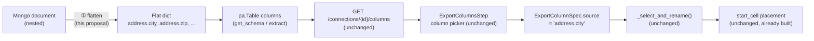

# JSON Source Keys for MongoDB — Architecture Plan

**Status:** Implemented (§3–§5; §6's compatibility check still open)
**Repos affected:** `udi-connectors`, `udi-etl-app`, `udi-etl-web`
**Date:** 2026-09-03

---

## 1. Why

The Export flow (`udi-etl-web/src/pages/ExportBuilder.tsx` → `ExportColumnsStep.tsx`,
`udi-etl-app/api/export_runner.py`) lets someone pick a source, extract table(s) into memory, join,
filter/sort, and place each field into an Excel cell (`ExportColumnSpec.start_cell`,
`udi-etl-app/api/schemas.py`). Every step of that pipeline already works against an arbitrary
`source` string — `_select_and_rename()` (`export_runner.py:92-98`) just does
`df[[c.source for c in columns]]`. Nothing about it is tabular-database-specific.

The gap is one level down: **MongoDB documents are nested, and the connector currently collapses
that nesting instead of exposing it as addressable columns.** `_serialize_doc()`
(`udi_connectors/mongodb/connector.py:115-127`) recurses into a nested `dict` and keeps it as a
nested `dict` *value* under one top-level key; a `list` gets stringified outright. `get_schema()`
(`connector.py:98-109`) builds its `pa.Schema` from those same serialized docs, so a document like

```json
{ "name": "Alice", "address": { "city": "Mumbai", "zip": "400001" } }
```

exposes exactly one selectable column — `address` — holding an opaque struct, not two columns
`address.city` / `address.zip`. There's no way to point `ExportColumnSpec.source` at a nested field
today, which is what "JSON source keys" means in the ask: let `source` be a dotted path into a
document, the same way it's already a plain column name for a SQL table.

## 2. Where this plugs in (nothing new to invent downstream)



Everything right of step ① — the API route, the column-picker UI, joins, filter/sort, cell
placement — already treats `source` as an opaque string key. If the connector hands back flat
column names, the rest of the stack needs **zero changes**, the same "config/schema-driven, no
per-connector frontend code" pattern this project already leans on everywhere else (e.g. how a new
`prompt_data` source needed no frontend change to get a working form). The only real work is step ①.

## 3. Proposed change: flatten at the connector boundary

Replace `_serialize_doc`'s recursive-nesting behavior with a flattening pass — `pandas.json_normalize`
with `sep="."` is the natural fit, since both call sites already build a `pd.DataFrame` from a list of
dicts:

- `get_schema()` (`connector.py:98-109`): normalize the sampled docs before `pa.Table.from_pandas(df)`.
- `extract()`'s batch loop (`connector.py:135-...`, both the async generator and `_extract_sync_impl`):
  normalize each batch's docs before building the `pa.Table`.

A document's top-level scalar fields are unaffected (`name` stays `name`); a nested object's leaves
become dotted paths (`address.city`, `address.zip`). This is additive to the schema, not a rename —
existing flat documents/collections produce identical column names to today.

**Arrays stay out of scope for v1.** Exploding an array field into multiple rows changes the row
count of the extract, which the rest of the pipeline (joins, `filter_query`, `sort_by`, row-wise cell
growth) all assume is stable per source document. Keep the existing behavior — a list serializes to
its `str()` representation as a single scalar column — and document it as a known limitation rather
than silently guessing at explode semantics nobody asked for.

## 4. Disambiguating dotted paths against the existing "table.column" convention

`export_runner.py` already uses a dot to mean "which table this column came from" once more than one
table/collection is joined (`_apply_joins`, `export_runner.py:37-64`): a single source keeps bare
column names, but 2+ sources get namespaced as `{table}.{column}` to avoid collisions. A JSON path
adds a *second* kind of dot with a different meaning, and the two need to compose without ambiguity:

| Scenario | `source` string | How it's parsed |
|---|---|---|
| One Mongo collection, flat field | `email` | bare column name (unchanged rule) |
| One Mongo collection, nested field | `address.city` | the connector's own flattened column name — no table prefix needed, single-source rule already skips prefixing (`export_runner.py:40-41`) |
| Two collections joined, nested field | `orders.address.city` | split on the **first** dot only: table = `orders`, column = `address.city` |

That last row is the one actual code change needed outside the connector: `_apply_joins`'s
namespacing (`frames[table].rename(columns={c: f"{table}.{c}" for c in frames[table].columns})`,
`connector.py:43-46`) already produces exactly this shape mechanically (it prefixes whatever column
name it's given, dots and all) — so no parsing change is actually required there. The one place that
*does* need a first-dot-only split is anywhere that currently assumes a single dot, if any exists;
an audit of `_apply_joins`/`_select_and_rename`/the join-key resolution in `ExportColumnsStep.tsx`
(`guessSharedKey`, `updateJoin`) should confirm none of them do a naive `split('.')` expecting exactly
two parts before this ships.

## 5. Frontend impact

None expected. `getColumns()` (`udi-etl-web/src/api/client.ts`) already just relays
`GET /connections/{id}/columns`, which calls `connector.get_schema(table_name)` and returns
`schema.names` (`connections.py`). Once `get_schema()` returns flattened names, `ExportColumnsStep`'s
column list (`available = ... entries.flatMap(...)`, `ExportColumnsStep.tsx:73-77`), the prompt parser
(`exportPromptParse.ts`), and the cell-mapping table all pick up `address.city` as just another string
in the list — the fuzzy prompt matcher already does substring matching on the *bare* (last-dot-segment)
name (`bareName()` in `exportPromptParse.ts`), so `"city"` in a prompt would already resolve to
`address.city` for free.

## 6. Compatibility risk to check before shipping

`_serialize_doc`'s current output shape (nested dict preserved, not flattened) may already be relied
on elsewhere — the S3 raw-landing path (`migrate_all`) and the Pipeline Designer's Athena-backed
transform stage both consume whatever schema `get_schema()`/`extract()` produce today. Flattening
column names changes what a previously-landed raw dataset's schema looks like going forward (new
runs get `address.city`, old landed data still has a nested `address` struct). This is the kind of
schema drift `pipeline.py`'s `publish_curated()` already logs a warning for
(`"Curated schema drift ... re-run the crawler"`, `pipeline.py`) — worth confirming that warning path
is acceptable here too, rather than assuming it silently is.

## 7. Implementation checklist

- [x] `mongodb/connector.py`: `_serialize_doc` now flattens nested dicts into dotted-path keys. Done as a
      manual recursive flatten (a `prefix` parameter accumulated across the recursion) rather than
      `pandas.json_normalize`, so the existing per-leaf stringification (`str(val)` — what already made
      `ObjectId`/dates/Decimal128 safe to put in a DataFrame) stays in one pass instead of needing a
      second pass after normalizing. All four call sites (`get_schema()`, both branches of `extract()`)
      go through this one function, so no other connector code changed.
- [x] Confirmed array fields still serialize as a single stringified scalar column (no explode) —
      verified against a real collection with a 2-item array, a 1-item array, and an empty array.
- [x] Audited every dot-based parse in `export_runner.py` and the frontend Export step — **no
      `.split('.')` exists anywhere in the pipeline**; every join/select/rename operation only
      concatenates or does whole-string dict/column lookups, never splits on a dot. The "exactly one
      dot" risk this item was checking for doesn't exist in the current code.
- [x] End-to-end verified against a real `mongodb` container: `GET /connections/{id}/columns` on a
      collection with `{name, address: {city, zip}, tags: [...]}` documents returned
      `["_id", "name", "address.city", "address.zip", "tags"]`; a full `/export` request mapping
      `name`/`address.city` to specific cells (`start_cell: "B2"`/`"D2"`) produced a correct `.xlsx`
      with those exact values in those exact cells.
- [ ] Not yet exercised: the `orders.address.city`-style triple-part case (nested field *and* a join
      against a second collection in the same export).
- [ ] Not yet decided: the schema-drift stance from §6, for if/when this reaches a pipeline that lands
      to S3/Athena rather than just the in-memory Export flow.

## 8. Non-goals

- No JSONPath/wildcard query syntax (`address[*].city`, `$.items[0].sku`) — flat dotted-key access only, matching what `json_normalize` already gives for free.
- No array explosion / row multiplication.
- No change to non-Mongo connectors — `file_upload`'s JSON handling is a separate, later extension if needed, not covered here.
